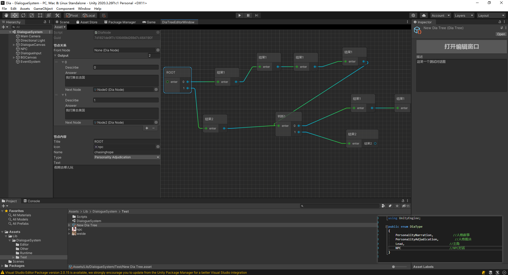
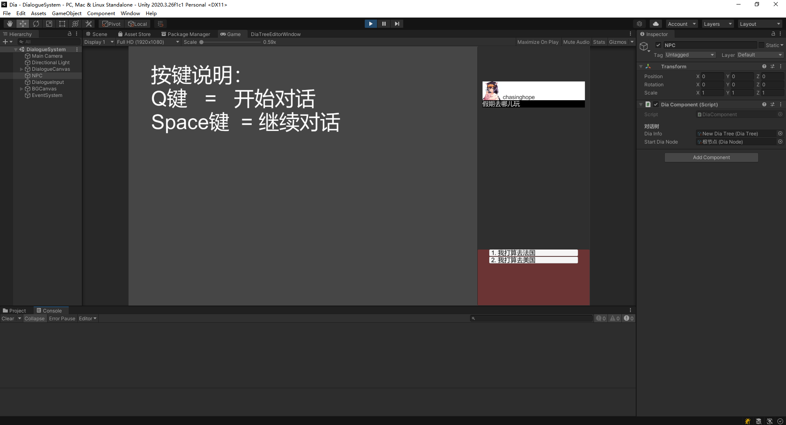
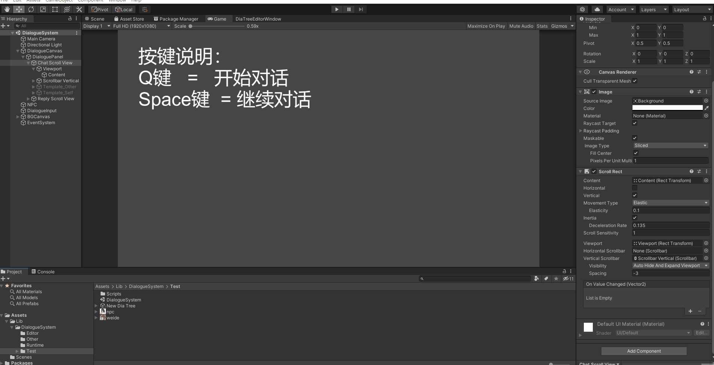

# Unity-Dialog-Graph
Unity Dialog Graph—— Quickly create a dialog branch node

## Sample







## 创建对话树

Create-> DiaTree

节点类型

```c#
public enum DiaType
{
    PersonalityNarration,         //人格叙事
    PersonalityAdjudication,      //人格裁决
    Lead,                         //主角
    NPC                           //NPC对话
}

```

仅仅是一个样例，可自行扩展

Lib/DialogSystem/Test/DialogSystem.scene 可查看具体细节。

